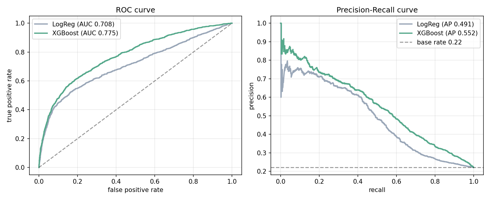
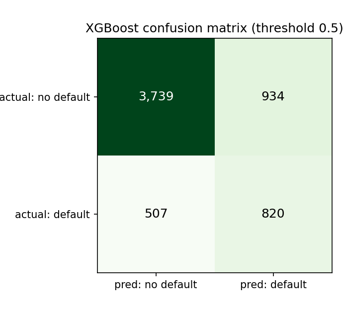
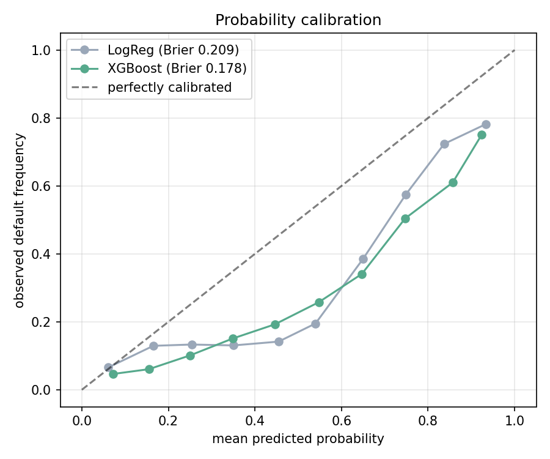
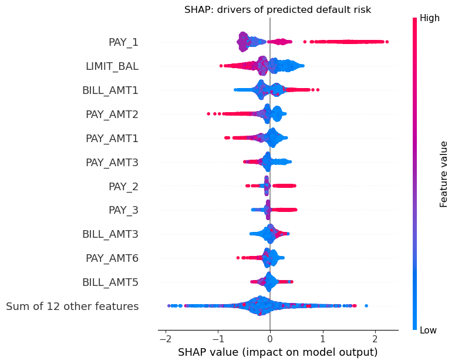
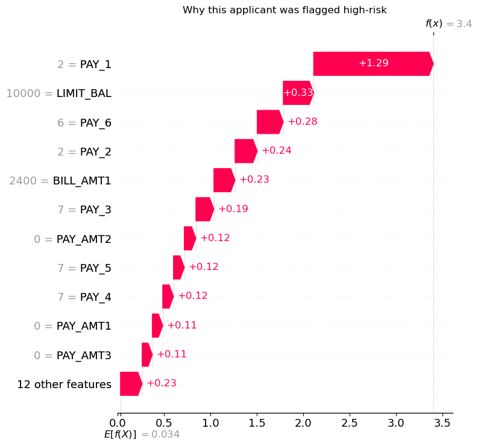

# Credit-Card Default Prediction with Explainable ML

**Predicting credit-card default — and explaining every decision — with gradient boosting, probability calibration, and SHAP.**

An interpretable, finance-focused classification pipeline on the UCI *Default of Credit Card Clients* dataset (30,000 accounts, ~22% default). Accuracy alone isn't enough in credit risk: lenders must **justify individual decisions**, so this project pairs a strong predictive model with calibrated probabilities and SHAP explanations at both the global and per-applicant level.

## Results

XGBoost clearly outperforms a logistic-regression baseline on the imbalance-aware metrics that matter when defaults are the minority class:

| Model | ROC-AUC | PR-AUC | Recall (default) | Brier |
| :--- | :---: | :---: | :---: | :---: |
| Logistic Regression | 0.708 | 0.491 | 0.62 | 0.209 |
| **XGBoost** | **0.775** | **0.552** | 0.62 | **0.178** |



*Only ~22% of accounts default, so precision-recall / PR-AUC are reported alongside ROC-AUC instead of misleading accuracy.*



## Calibration

Predicted probabilities are well-calibrated (low Brier score) — essential when scores feed real lending thresholds:



## Interpretability (SHAP)

**Global drivers** — the most recent repayment status (`PAY_1`) dominates default risk, followed by the credit limit (`LIMIT_BAL`) and recent bill/payment amounts:



**Per-applicant explanation** — every score decomposes into the features that pushed it up or down, making each decision auditable:



## How it works

- **Preprocessing:** collapse undocumented `EDUCATION` / `MARRIAGE` category codes; stratified 80/20 split.
- **Models:** class-balanced logistic regression (baseline) and an XGBoost classifier with `scale_pos_weight` tuned for the 22% default rate.
- **Evaluation:** ROC-AUC, PR-AUC, precision/recall/F1, and probability calibration (Brier score).
- **Explainability:** SHAP `TreeExplainer` for global feature importance and local per-applicant attributions.

## Run it

```bash
pip install -r requirements.txt
python download_data.py     # fetches the UCI dataset
python train_credit.py      # trains models -> assets/ + results/
```

## Repo structure

```text
train_credit.py   pipeline: preprocessing, models, evaluation, SHAP, figures
download_data.py  fetch the UCI default-of-credit-card-clients dataset
assets/           ROC/PR, confusion-matrix, calibration, and SHAP figures
results/          metrics.csv / metrics.json
```

## Tech stack

Python · XGBoost · scikit-learn · SHAP · Pandas · Matplotlib
